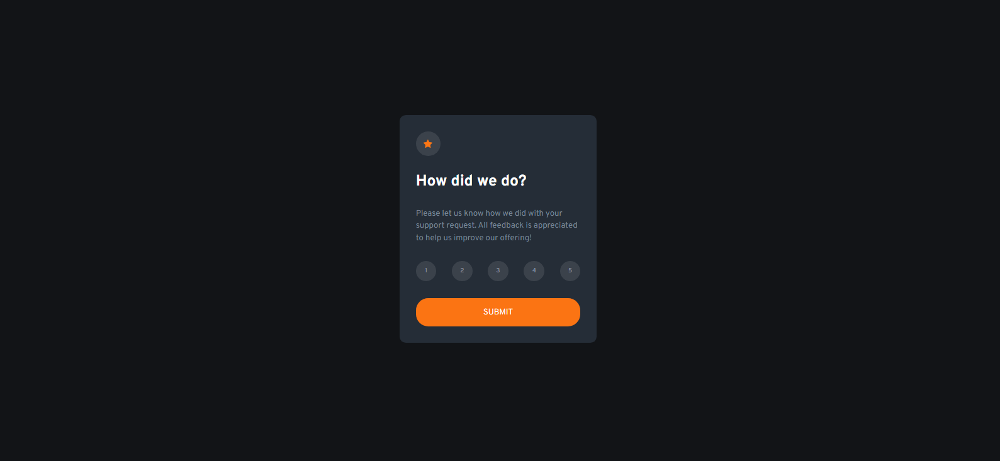

# Frontend Mentor - Interactive rating component solution

This is a solution to the [Interactive rating component challenge on Frontend Mentor]

## Table of contents

- [Overview](#overview)
  - [The challenge](#the-challenge)
  - [Screenshot](#screenshot)
  - [Links](#links)
- [My process](#my-process)
  - [Built with](#built-with)
  - [What I learned](#what-i-learned)
- [Author](#author)

## Overview

### The challenge

Users will be able to:

- View the optimal layout for the app depending on their device's screen size
- See hover states for all interactive elements on the page
- Select and submit a number rating
- See the "Thank you" card state after submitting a rating

### Screenshot

### Links

- Solution URL: [Add solution URL here](https://github.com/Naveed89-tech/interactiverating)
- Live Site URL: [Add live site URL here](https://interactiveratingcomponentnew.netlify.app/)

## My process

### Built with

- Semantic HTML5 markup
- Tailwind CSS
- Flex-box
- Javascript

### What I learned

During developing this, i have learned how to manipulate the element with Vanilla javascript

## Author

- Frontend Mentor - [@Naveed89-tech](https://www.frontendmentor.io/profile/Naveed89-tech)
- Twitter - [@Naveed_Tech_T](https://twitter.com/Naveed_Tech_T)
